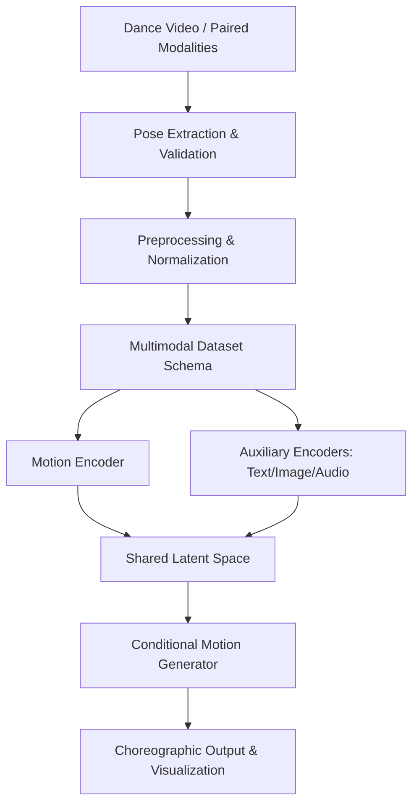

# ChoreoAI 🩰✨
### AI-Enabled Choreography — Dance Beyond Music

[](https://opensource.org/licenses/MIT)
[](https://www.python.org/downloads/)
[](https://summerofcode.withgoogle.com/)

---

## 📖 Project Overview

**ChoreoAI** is an experimental open-source framework designed to expand the digital perception of dance. While traditional AI choreography focuses on music-to-motion prediction, ChoreoAI treats dance as a **multimodal dialogue**. By aligning 3D motion with text, imagery, architecture, and spoken word, we empower artists to explore AI as a generative partner in the choreographic process.

Developed as part of the **HumanAI** initiative, this project prioritizes artist-led design and expressive expansiveness over reductive movement prediction.

## 🚀 Key Features

- 🎥 **Robust Motion Extraction**: Pipeline for converting mono-video into normalized 3D skeletal point-cloud sequences.
- 🧠 **Multimodal Alignment**: Contrastive learning backbone (inspired by CLIP) for shared latent embeddings of dance and auxiliary modalities.
- 🌪️ **Generative Synthesis**: Conditional Motion Diffusion Model (MDM) for high-fidelity 3D choreography generation from arbitrary prompts.
- 📊 **Metric Suite**: Integrated evaluation tools including Frechet Motion Distance (FID) and semantic retrieval accuracy.
- 🎨 **Artist-in-the-Loop**: Schema-driven "prompting" system designed for intuitive choreographic input.

## 🏗️ Project Architecture



## 🛠️ Installation

```bash
# Clone the repository
git clone https://github.com/fallofpheonix/choreo_ai.git
cd choreo_ai

# Set up environment
python -m venv .venv
source .venv/bin/activate
pip install -r requirements.txt

# Install ChoreoAI in editable mode
pip install -e .
```

## 📂 Repository Structure

- `src/choreoai/`: Core library (Extraction, Alignment, Generation).
- `data/`: Sample datasets and modality pairs.
- `configs/`: Model hyperparameters and training configurations.
- `notebooks/`: Exploratory analysis and artist-led visualization demos.
- `tests/`: Comprehensive unit and integration tests.

## 🤝 Contributing

We welcome contributions from developers, researchers, and artists! Please see our [Contribution Guidelines](CONTRIBUTING.md) for more information.

## 📬 Contact & Application

ChoreoAI is a **Google Summer of Code (GSoC) 2026** project. 

Please **DO NOT** contact mentors directly by email. Instead, please email [human.ai.choreo@gmail.com](mailto:human.ai.choreo@gmail.com) with subject line **“Test Submission: AI Choreo”** and include your CV and GitHub repository link.

---

### Mentors
- **Mariel Pettee** (Lawrence Berkeley National Laboratory)
- **Ilya Vidrin** (Northeastern University)

---
*Developed for HumanAI — Imagine expansiveness, not conformity.*
