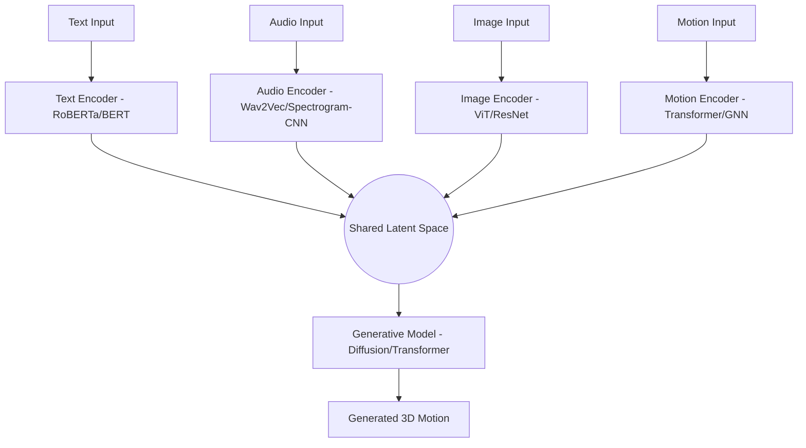

# ChoreoAI: Roadmap & Architecture Plan

## 1. Project Overview
ChoreoAI is a multimodal-to-motion translation framework designed to bridge the gap between various artistic modalities (text, audio, image) and 3D human movement. The goal is to move beyond simple music-to-dance mappings and explore expressive, any-to-any generative capabilities.

## 2. System Architecture

### 2.1 Data Pipeline
The foundation of ChoreoAI is a structured multi-stage data pipeline.
- **Stage 1: Raw Collection**: Ingesting high-quality dance videos or motion capture data.
- **Stage 2: Pose Extraction**: Utilizing heavy-weight backends (MediaPipe, OpenPose, or specialized 3D pose estimators) to extract (T, K, 3) skeletal coordinates.
- **Stage 3: Normalization & Preprocessing**:
  - Interpolate missing joints.
  - Smooth noisy sequences (moving average/Savitzky-Golay).
  - Normalize coordinates relative to a root joint (e.g., hip).
  - Temporal scaling/cropping.
- **Stage 4: Tokenization/Embedding**: Mapping non-motion modalities (text, audio) into a shared latent space.

### 2.2 Model Architecture

#### Multimodal Embedding Layer
A contrastive learning objective (CLIP-style) is used to align different modalities in the shared latent space. This allows the model to understand that a "rhythmic" audio snippet corresponds to "energetic" motion and "fast-paced" text.

#### Generative Model
A conditional **Diffusion Model** is preferred for high-fidelity motion generation.
- **Input**: Latent vector from the shared space + Gaussian noise.
- **Output**: Denoised 3D skeletal sequence.
- **Conditioning**: Classifier-free guidance on the modality latents.

## 3. Implementation Roadmap (7-Week Plan)

### Phase 1: Infrastructure & Data (Weeks 1-2)
- **Goal**: Establish a robust dataset handling system.
- **Tasks**:
  - Implement the `choreoai scan` and `choreoai validate` tools for dataset integrity.
  - Finalize the `pose_extractor.py` module with MediaPipe support.
  - Develop the `preprocess.py` suite for smoothing and normalization.

### Phase 2: Multimodal Encoding (Weeks 3-4)
- **Goal**: Implement and train initial modality encoders.
- **Tasks**:
  - Set up `TextEncoder`, `AudioEncoder`, and `MotionEncoder`.
  - Implement a contrastive loss (`losses.py`) to align motion with text prompts.
  - Create the `torch_dataset.py` for efficient multimodal batching.

### Phase 3: Generative Modeling (Weeks 5-6)
- **Goal**: Build the core generation engine.
- **Tasks**:
  - Implement the diffusion backbone in `generator/`.
  - Develop the training loops in `train_generator.py`.
  - Integrate inference logic in `inference.py` for text-to-motion generation.

### Phase 4: Refinement & Artist-Led Design (Week 7)
- **Goal**: Verification and aesthetic alignment.
- **Tasks**:
  - Build visualization tools using Blender/Three.js.
  - Evaluate model performance using Fréchet Motion Distance (FMD).
  - Iterate on generation quality based on feedback from dance artists.

## 4. Key Metrics
- **FMD (Fréchet Motion Distance)**: Measures distribution similarity between real and generated motion.
- **Multimodal Alignment**: Retrieval accuracy between text prompts and motion sequences in the latent space.
- **Visual Faithfulness**: Qualitative assessment by professional choreographers.
