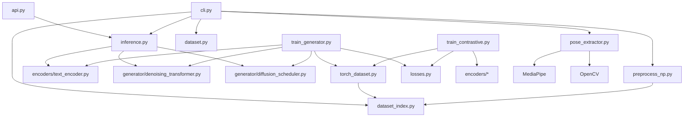

# System Dependency Graph

## Internal Dependencies
- `choreoai.api` -> `choreoai.inference`
- `choreoai.inference` -> `choreoai.encoders.text_encoder`, `choreoai.generator.denoising_transformer`, `choreoai.generator.diffusion_scheduler`
- `choreoai.train_generator` -> `choreoai.torch_dataset`, `choreoai.generator.*`, `choreoai.encoders.text_encoder`, `choreoai.losses`
- `choreoai.train_contrastive` -> `choreoai.torch_dataset`, `choreoai.encoders.*`, `choreoai.losses`

## External Dependencies
- `torch`, `torchvision`, `torchaudio`
- `transformers` (HuggingFace)
- `mediapipe`, `opencv-python`
- `fastapi`, `uvicorn`
- `numpy`, `pandas`, `scipy`
- `hydra-core`, `omegaconf`
- `wandb`
